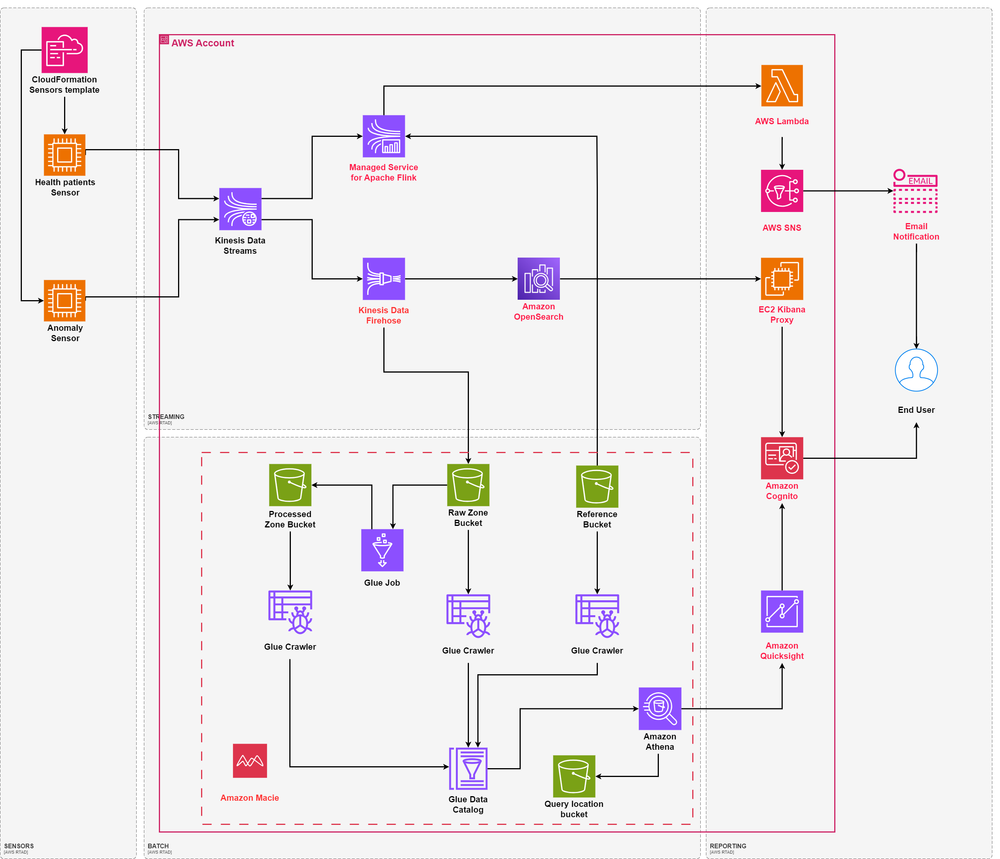
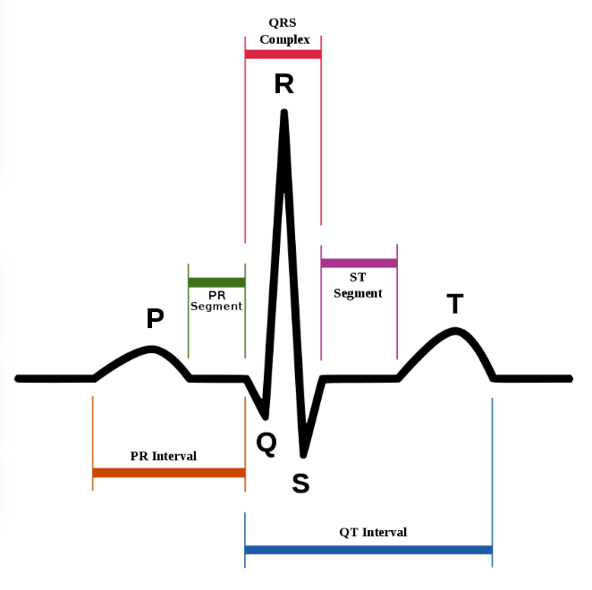

# AWS_RTAD

## AWS Real Time Anomaly Detection Platform



### Overview

The visible diagram shows expected architecture of real time anomaly detection platform used in the medicine to create a high performant system to notify suspicious behaviour in cardiology.

System is designed to find strange behaviour and notify medical staff in case of hearth issues. At this point system is designed 

Platform is divided into 4 parts:

* [Sensors](../docs/sensors/readme.md)
* [Streaming](../docs/streaming/readme.md)
* [Batch](../docs/batch/readme.md)
* [Reporting](../docs/reporting/readme.md)

### What is anomaly in this case?
To create such a system, there were a need to simplify detection at the very beginning.



Diagram shows typical ECG of human hearth. In this case we need to focus on QT interval that starts at the beginning of the QRS complex (caused by the depolarization of ventricles) and ends at the end of the T wave (the repolarization of ventricles).

Cardiologists often measure the QT interval since its prolongation correlates with a prevalence of ventricular arrhythmias such as torsades de pointes and is a risk factor for sudden cardiac death. The duration of the QT interval is highly influenced by heart rate: the faster the rhythm, the shorter the QT interval is. Because of that, a correction of the QT interval for heart rate should be made. It can be performed with, Bazett’s formula:

```
QTc = QT / √RR = QT / √(60/BPM * 1000)

where

QTc - corrected QT [ms]
QT  - duration of QT interval [ms]
RR  - duration of RR interval (length between R points in two separated cycles) [ms]
BPM - hearth rate [beats per minute]

```

There are some factors determining what level of QTc is accepted, but to simplify the approach, 2 factors were taken:

* gender
* age

So on there is a possibility to select correct intervals for QTc:

| Category           | Age   | Gender | Optimal QTc [ms] |
| :---:              | :---: | :---:  | :---:            |
| Children           | 0-15  | M/F    | 300 - 440        |
| Women              | >15   | F      | 300 - 450        |
| Men                | >15   | M      | 300 - 430        |

Based on this factors we can run the 2 levels of alerts if values are excedeed:
* 30-60 ms --> we are opening sliding window to observe if this is a single datapoint or a thread. Based on practical applications 
*